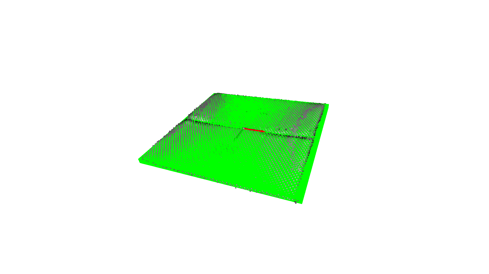

# 📦 Box Pose Estimation from RGB-D Data

This project performs **6D pose estimation of flat rectangular boxes** using RGB-D input. It uses **Open3D**, **OpenCV**, and **PCA-based analysis** to estimate the **3D center position** and **orientation** of boxes placed on a known surface. The pipeline is optimized for planar objects like cardboard boxes on pallets or tables, typically found in industrial or logistics settings.

---

## 🧠 Overview

The system takes an RGB-D image as input and executes the following pipeline:

1. **Constructs a point cloud** using camera intrinsics.
2. **Transforms** the point cloud into the world coordinate frame.
3. **Filters** out irrelevant parts of the scene using spatial or geometric constraints.
4. **Segments** remaining objects using clustering.
5. **Estimates pose** by fitting a plane, projecting to 2D, applying PCA and OpenCV.
6. **Visualizes** oriented 3D bounding boxes and coordinate axes.

---

## 🔄 Pipeline Steps

| Step                           | Description                                                          |
| ------------------------------ | -------------------------------------------------------------------- |
| **1. Load Data**               | Load depth, color, intrinsics, and extrinsics from `.npy` files.     |
| **2. Point Cloud Creation**    | Construct a colored 3D point cloud using Open3D.                     |
| **3. World Transformation**    | Apply extrinsics to align the point cloud to the world frame.        |
| **4. Downsampling (optional)** | Reduce point cloud size for speed without losing structure.          |
| **5. Filtering**               | Remove irrelevant parts of the scene.                                |
| **6. Clustering**              | Group remaining geometry using DBSCAN.                               |
| **7. Pose Estimation**         | Recover 3D position and orientation using PCA and `cv2.minAreaRect`. |
| **8. Visualization**           | Render the result with 3D boxes and axes in Open3D.                  |

---

## 💥 Filtering Strategy and Assumptions

### 🔹 Strategy 1: Region of Interest (ROI)

* **Assumptions**:

  * The camera is **fixed**.
  * The **height of the ground** and **object placement area** is known.
  * Boxes are **expected to fall within a known spatial bounding region**.

* **Method**:

  * Crop the point cloud using a pre-defined **axis-aligned bounding box** in 3D.

This is **fast**, reliable, and works well in structured environments.

### 🔹 Strategy 2: Full Filtering Pipeline

* **Assumptions**:

  * The camera is fixed, but no strict ROI box is defined.
  * The ground is relatively flat and lower in Z height than objects of interest.
  * Boxes lie on horizontal surfaces.

* **Method**:

  1. **Z Filter**: Remove points below a height threshold (e.g., floor).
  2. **Normal Filter**: Keep only horizontally aligned surfaces (e.g., pallet/table tops).
  3. **Statistical Denoising**: Remove outlier points.
  4. **Clustering**: Segment surfaces using DBSCAN.
  5. **Min Cluster Size**: Discard small clusters that are likely noise.

This method is **robust** to scene variability and doesn't require hardcoded spatial limits.

---

## 🖐️ Pose Estimation Explained

After filtering, for each cluster:

1. **Plane Fitting (RANSAC)**:

   * Removes outliers.
   * Ensures points lie on a flat surface.

2. **2D Projection with PCA**:

   * Project points onto the plane and find principal directions.

3. **2D Bounding Box Fitting**:

   * Use `cv2.minAreaRect` to get the smallest area rectangle in 2D.

4. **Reconstruct 3D Orientation**:

   * Convert 2D directions into 3D frame (X/Y from PCA, Z from plane normal).

5. **Box + Frame Visualization**:

   * Render a green box and aligned coordinate axes for each cluster.

---

## 📈 Results

| Step                          | Time (s)  |
| ----------------------------- | --------- |
| **Load data**                 | 0.053     |
| **Create point cloud**        | 0.051     |
| **Transform to world frame**  | 0.234     |
| **Filtering (FULL strategy)** | 0.027     |
| **Pose estimation**           | 0.029     |
| **✅ Total execution time**    | **0.395** |



---

## 🚀 How to Run

### 🔧 Prerequisites

- Install [Poetry](https://python-poetry.org/docs/#installation):

   ```bash
   curl -sSL https://install.python-poetry.org | python3 -
   ```
- Please modify the path to where your data is in box_pose_estimation/estimation/config.yaml

---

### ▶️ Run the Pipeline

Once Poetry is installed and your config is modified, run the pipeline using the following script:

```bash
./scripts/run_pose_estimation.sh
```


Happy estimating! 🚀
