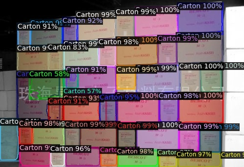
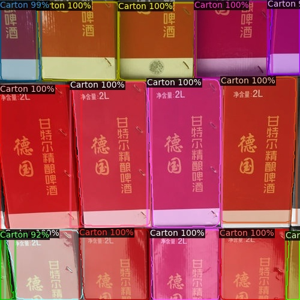
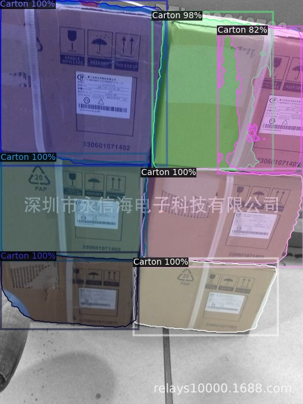
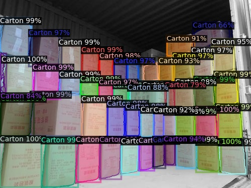
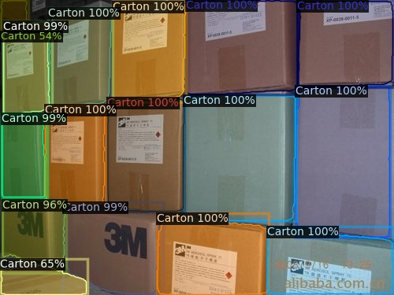

# 📦 Box Detection using Detectron2

This project applies Facebook AI's [Detectron2](https://github.com/facebookresearch/detectron2) framework to perform instance segmentation on carton boxes. The model is trained and evaluated on a custom COCO‑format dataset. Dataset as suggested in the challenge [Stacked Carton Dataset](https://github.com/yancie-yjr/scd.github.io)

---

## 🧠 What We Did

* Set up a Detectron2‑based training pipeline using Mask R‑CNN with a ResNet‑50 backbone and FPN.
* Trained on a one‑class dataset (`Carton`) to identify and segment individual box instances.
* Evaluated performance on a COCO‑style validation set.
* Visualized predictions with high confidence threshold (0.5+).

---

## ⚙️ Training Configuration

| Parameter              | Value     | Reason                                                                 |
|------------------------|-----------|------------------------------------------------------------------------|
| `ims_per_batch`        | 4         | Increased from 2 for better GPU utilization                           |
| `batch_size_per_image` | 256       | Increased proposals per image to improve object coverage              |
| `base_lr`              | 0.00025   | Standard low learning rate for stable convergence                     |
| `max_iter`             | 10000     | Trains longer to improve learning compared to short default runs      |
| `num_workers`          | 2         | Parallel data loading without overloading typical laptop CPUs         |
| `num_classes`          | 1         | Only one object category (Carton) in the dataset                      |

This setup was tuned for small-scale training with a single-class dataset, optimizing learning stability and maximizing GPU efficiency.

---

## 📊 Results

| Metric                | BBox (AP) | Segm (AP) |
| --------------------- | --------- | --------- |
| **mAP @\[0.50:0.95]** | **65.2**  | **68.1**  |
| AP50                  | 87.4      | 87.4      |
| AP75                  | 73.5      | 76.3      |
| AP<sub>small</sub>    | 23.1      | 21.5      |
| AP<sub>medium</sub>   | 64.6      | 67.2      |
| AP<sub>large</sub>    | 76.2      | 80.3      |
| **AR** (maxDets=100)  | 70.9      | 72.8      |


Example visualization output:







---

📈 How Good Are These Results?

These are pretty solid numbers for a quick challenge:

- The model finds and segments large boxes very well.

- It struggles with small boxes, which is common.

- Overall accuracy and recall are quite strong.

I trained this model quickly for the challenge, but there are definitely ways to make it better:

- Use a higher-resolution input to help detect small boxes.

- Add more diverse training images with different lighting and box sizes.

- Try a stronger backbone, like ResNet-101 or Swin Transformer.

- Enable test-time augmentation to improve results during inference.

So while this version works well, there's still room to improve if we wanted to push the results higher.


## 🚁 Deployment

### ✅ Requirements

* Python 3.11
* PyTorch 2.7.0 + CUDA 11.8
* Detectron2
* OpenCV, PyYAML, etc. (see `requirements.txt`)
* Visual C++ Redistributables if you use Windows

---

### ⚙️ Setup

You can use the provided script to prepare everything:

```bash
bash setup_env.sh
```

This will:

* Create a virtual environment
* Install PyTorch + CUDA
* Install Detectron2 and all dependencies

Make sure to:

* Place your `model_final.pth` inside the configured `output_dir`
* Adjust `root_path` in `config.yaml` to your dataset location. Please download the dataset from https://github.com/yancie-yjr/scd.github.io

---

### 🏋️ Training

To run training

```bash
python box_segmentation/train_segmentation.py
```

### 🚀 Inference

To run prediction and visualization:

```bash
python box_segmentation/run_segmentation.py
```


